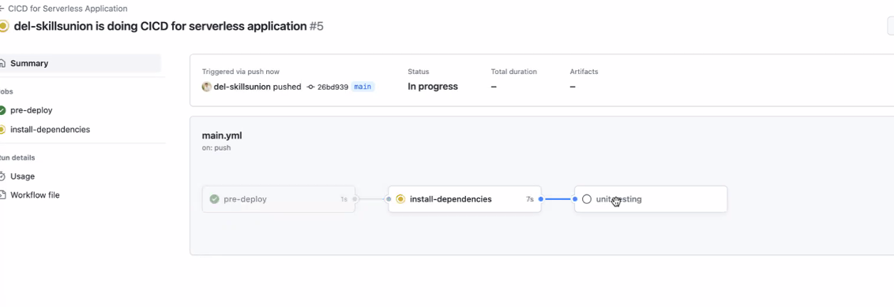
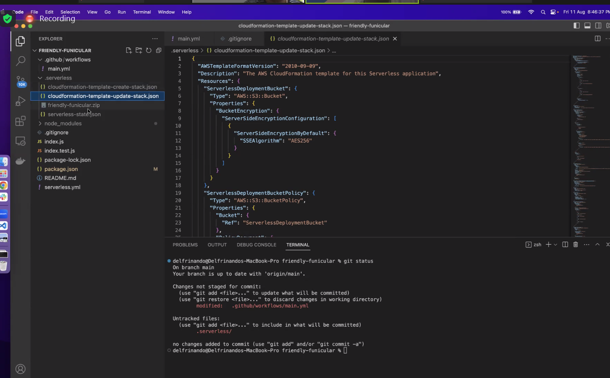

# 3.12CDserverless_v2

in git hub action files

name: # is the name of the action
actor: is the person to .....

on: push: branch
#on main branch and other branch (because *, so any branch can)  it'll use this workflow

Job is a set of steps in workflow that'll be exercuted with the same workflow
runs on is the configuration 

predeploy is not a keyword, and can be anything - it'll appear on the pipeline. 

install-dependencies is a few job, so the indentation needs to be correct with all other jobs.

___________code--------

name: CICD for Serverless Application-title of action
run-name: ${{github.actor}} is doing CICD for serverless application

on: 
  push:
    branches: [ main, "*"]

jobs:
  pre-deploy:
    runs-on:ubuntu-lastest
    steps:
      - run: echo "The job is automatically triggered by a ${{ github.event.name }} event."

  install-dependencies:
    runs-on: ubuntu-latest
    steps:
      - name: Check out repository code
      - uses: actions/checkout@v3
      - name: Run installation of dependencies commands
        run: npm install

  
________________________

after index.test.js is done, need to test it.... 

before testing using jest index.test.js, we need to change the scripts below code to 

{
  "name": "3.12cdserverless_v2",
  "version": "1.0.0",
  "description": "",
  "main": "index.js",
  "scripts": {
    "test": "echo \"Error: no test specified\" && exit 1" # the whole "" should be "jest" instead for "jest index.test.js" to work

  },
  "author": "",
  "license": "ISC",
  "dependencies": {
    "save-dev": "^0.0.1-security",
    "serverless": "^3.34.0"
  },
  "devDependencies": {
    "jest": "^29.6.2",
    "serverless-offline": "^12.0.4"
  },
  "repository": {
    "type": "git",
    "url": "git+https://github.com/wishingbox111/3.12CDserverless_v2.git"
  },
  "bugs": {
    "url": "https://github.com/wishingbox111/3.12CDserverless_v2/issues"
  },
  "homepage": "https://github.com/wishingbox111/3.12CDserverless_v2#readme"
}

------------------------

either do above or below , using github actions to automatically run the npm test (or jest index.test.js)

name: CICD for Serverless Application-title of action
run-name: ${{github.actor}} is doing CICD for serverless application

on: 
  push:
    branches: [ main, "*"]

jobs:
  pre-deploy:
    runs-on: ubuntu-latest
    steps:
      - run: echo "The job is automatically triggered by a ${{ github.event.name }} event."

  install-dependencies:
    runs-on: ubuntu-latest
    steps:
      - name: Check out repository code
        uses: actions/checkout@v3
      - name: Run installation of dependencies commands
        run: npm install

  unit-testing:
    runs-on: ubuntu-latest
    steps:
      - name: Check out repository code
        uses: actions/checkout@v3
      - name: Run installation of dependencies commands # this covers npm install also so don't need the install-dependencies in the above block also!
        run: npm install
      - name: Run unit testing command
        run: npm test

  

# added unit-testing

after adding the needs: in each job-
        

        The action will be horizontal flow, without the needs it'll be a one box by one box one after another like this:

        

        
        
in terminal (admin powershell)
type: serverless deploy

sls deploy - is also the same

-----------------------------------

add the deployment to lambda with a deploy in main.yml

before deploy, remember to add the .serverless to .git ignore so that the .serverless with lots of files is not uploaded into github.

  deploy:
    name: deploy
    runs-on: ubuntu-latest
    needs: unit-testing
    steps:
      - name: Check out repository code
        uses: actions/checkout@v3
      - name: use Node.js ${{ matrix.node-version }}
        uses: actions/setup-node@v3
        with:
          node-version: ${{ matrix.node-version }}
      - run: npm ci
      - name: serverless deploy
        uses: serverless/github-action@v3.2
        with:
          args: deploy
        env:
          AWS_ACCESS_KEY_ID: ${{ secret.AWS_ACCESS_KEY_ID}}
          AWS_SECRET_ACCESS_KEY: {{ secret.AWS_SECRET_ACCESS_KEY}}

*** my title cannot be 3.12cdserverless_v2, it can only use hypen and not underscore and the start cannot be a number , it has to start with an alphabet.

          ----------------------

